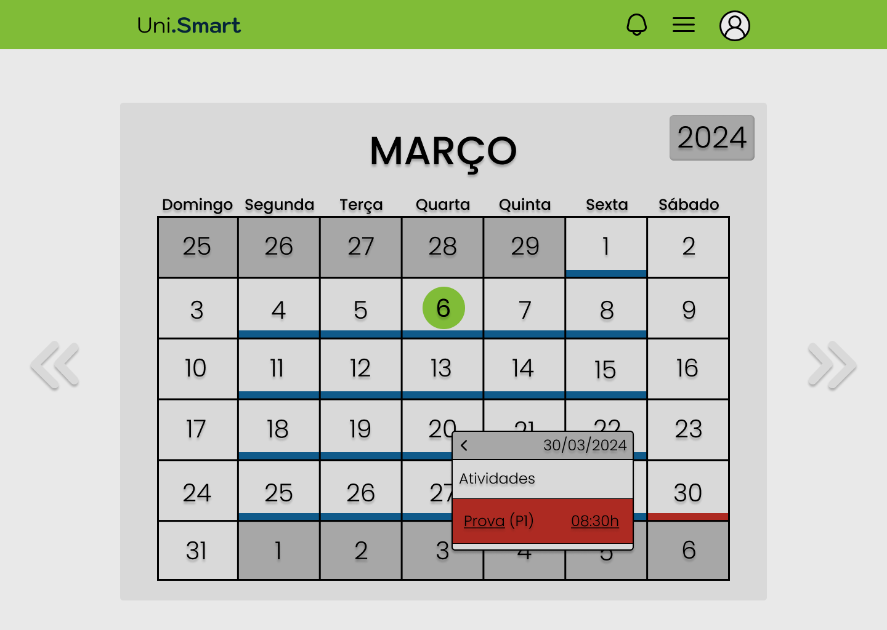
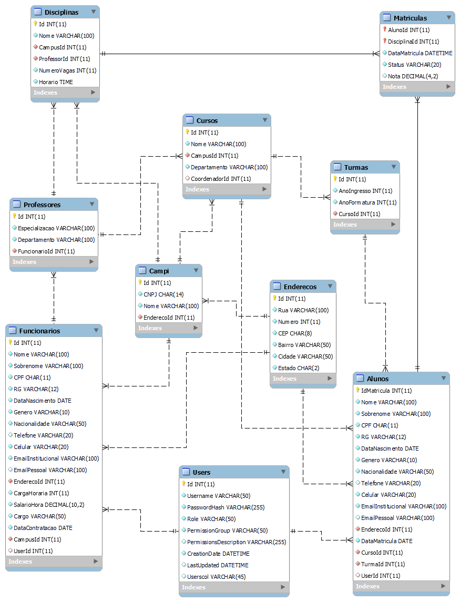
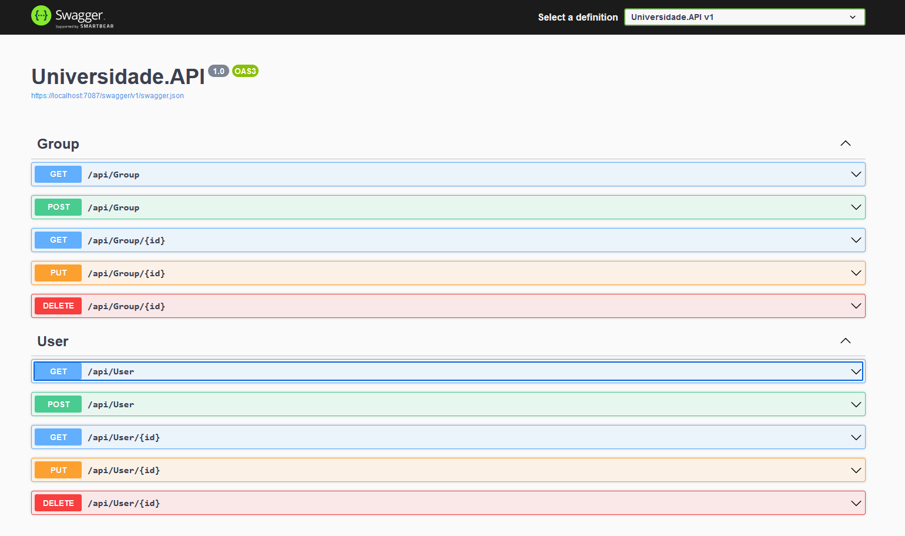
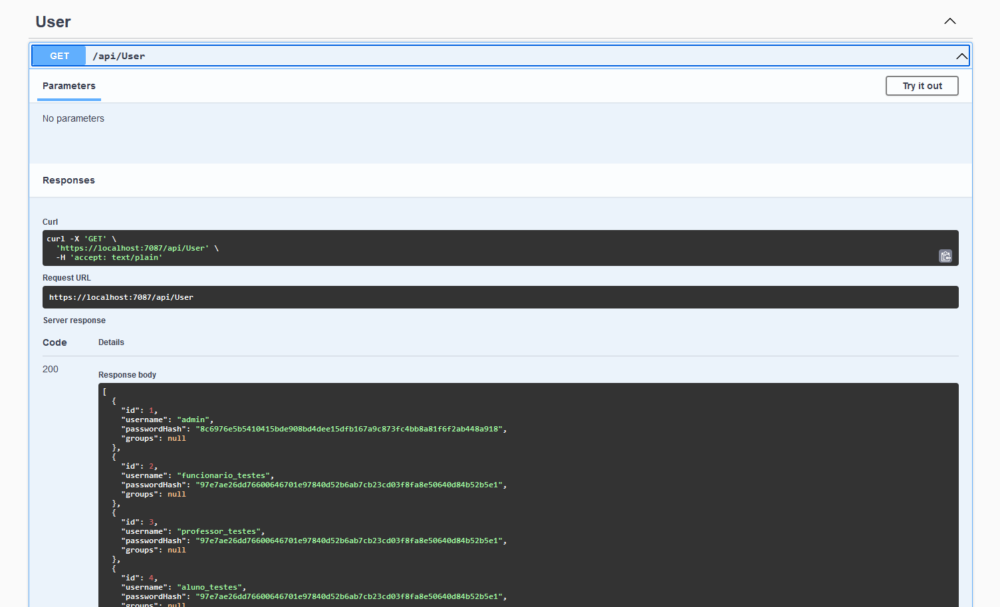
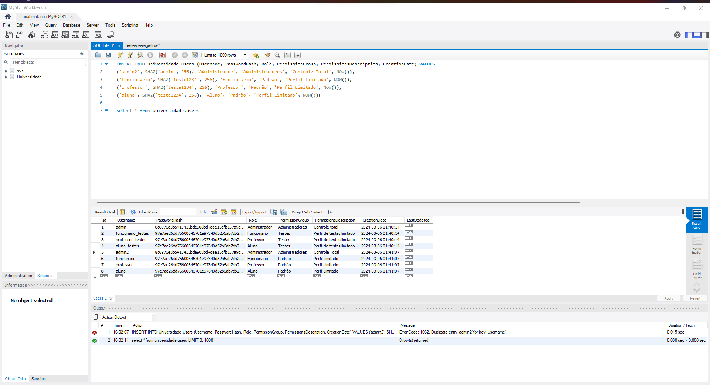

# Sistema de Gerenciamento Universitário

Este projeto foi desenvolvido como parte da disciplina Projeto Integrador III: Desenvolvimento de Sistemas Orientado a Objetos.

O sistema foi desenvolvido em C# utilizando o framework ASP.NET para a API de conexão com o banco de dados, enquanto o Node.js foi empregado para gerenciar a interface web GUI. O banco de dados utilizado foi o MySQL , implementado em um container Docker, visando simplificar os testes e facilitar a utilização por todos os colaboradores do grupo.

  
  
  
  
  
  
  
  
  

## Funcionalidades

- **Login de Usuário**: Limita funcionalidades ao sistema a usuários autenticados.
- **Cadastro de Alunos**: Permite o cadastro e gerenciamento de alunos matriculados na universidade.
- **Cadastro de Funcionários**: Possibilita o registro e gerenciamento dos funcionários.
- **Dashboard do Aluno**: Página do aluno onde ele pode gerenciar suas matrículas e atualizar seus dados.
- **Matrícula em Disciplinas**: Permite que alunos se matriculem em disciplinas disponíveis.
- **Dashboard do Professor**: Página do professor onde ele pode gerenciar as aulas que ministra.
- **Dashboard do Funcionário**: Página do funcionário com informações de pagamento e dados pessoais.
- **Gestão de Disciplinas**: Permite a criação, edição e exclusão de disciplinas oferecidas pela universidade.

## Protótipos

As telas da interface Web GUI foram desenvolvidas utilizando a ferramenta online Figma.

### Tela Inicial

## Dashboard do Funcionário (Administrador)

.png>)
.png>)

### Dashboard do Aluno

.png>)
.png>)

### Dashboard do Professor

.png>)
.png>)

### Calendário

> [Apresentação de telas na plataforma](https://www.figma.com/proto/aO0cKZjGMOtKTbFmtgoUG5/Projeto-Integrador?type=design&node-id=26-60&t=qMezBdqddBhRHF38-1&scaling=min-zoom&page-id=0%3A1&mode=design)

## Banco de Dados

O sistema possui persistência de dados por meio de um servidor MySQL, de acordo com o Modelo Entidade-Relacionamento (MER) abaixo:

## API

A API, quando completa, será eventualmente utilizada para gerenciar a comunicação e as requisições entre a aplicação web e o banco de dados.

Alguns dos controllers e models já foram implementados no back-end e conseguem recuperar dados do MySQL como pode ser visto abaixo.

## Colaboradores

    <table style="width: 100%; border-collapse: collapse; text-align: center;">
    <tr>
        <td style="padding: 20px; border: 1px solid #ddd; vertical-align: middle;">
            
            <a href="https://github.com/jvitor-alol" target="_blank">
jvitor-alol
</a>
        </td>
        <td style="padding: 20px; border: 1px solid #ddd; vertical-align: middle;">
            
            <a href="https://github.com/Lynn-Noob" target="_blank">
Lynn-Noob
</a>
        </td>
        <td style="padding: 20px; border: 1px solid #ddd; vertical-align: middle;">
            
            <a href="https://github.com/Guilherme-Soares05" target="_blank">
Guilherme-Soares05
</a>
        </td>
        <td style="padding: 20px; border: 1px solid #ddd; vertical-align: middle;">
            
            <a href="https://github.com/Rosicre" target="_blank">
Rosicre
</a>
        </td>
    </tr>
    <tr>
        <td style="padding: 20px; border: 1px solid #ddd; vertical-align: middle;">
            
            <a href="https://github.com/mirelaads" target="_blank">
mirelaads
</a>
        </td>
        <td style="padding: 20px; border: 1px solid #ddd; vertical-align: middle;">
            
            <a href="https://github.com/medinaandre" target="_blank">
medinaandre
</a>
        </td>
        <td style="padding: 20px; border: 1px solid #ddd; vertical-align: middle;">
            
            <a href="https://github.com/dkexs" target="_blank">
dkexs
</a>
        </td>
        <td style="padding: 20px; border: 1px solid #ddd; vertical-align: middle;">
            
            <a href="https://github.com/PedroBrito22" target="_blank">
PedroBrito22
</a>
        </td>
    </tr>
  </table>

